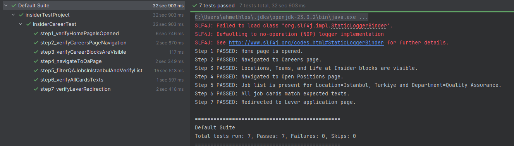

## 🧪 Insider Careers – Selenium Test Automation

### Overview

This project automates the **Insider Career Page** QA flow using **Java + Selenium + TestNG** under the Page Object Model (POM) design pattern.
It validates the full navigation and filtering process on [useinsider.com](https://useinsider.com), including:

1. Verifying the **Home Page** is loaded correctly.
2. Navigating through **Company → Careers** and checking the visibility of key blocks (*Locations*, *Teams*, *Life at Insider*).
3. Visiting the **Quality Assurance Careers** page and clicking **See all QA jobs**.
4. Filtering jobs by **Location: Istanbul, Turkey** and **Department: Quality Assurance**.
5. Ensuring that all listed positions match the filters.
6. Opening the first job and confirming redirection to the **Lever Application** form.

---

### 🧰 Tech Stack

| Category                 | Technology                     |
| ------------------------ | ------------------------------ |
| **Language**             | Java 23                        |
| **Automation Framework** | Selenium WebDriver 4.38.0      |
| **Test Framework**       | TestNG 7.10.2                  |
| **Build Tool**           | Maven                          |
| **Driver Management**    | WebDriverManager 6.3.2         |

---

### 📁 Project Structure

```
src/
 └── test/java/com/salih/
      ├── pages/
      │   ├── BasePage.java
      │   ├── HomePage.java
      │   ├── CareersPage.java
      │   ├── QAJobsPage.java
      │   └── OpenPositionsPage.java
      ├── tests/
      │   ├── BaseTest.java
      │   └── InsiderCareerTest.java
      │   └── testng.xml
      └── tests/listeners/
          └── TestListener.java
```

---

### ⚙️ How to Run Locally

1. **Clone the repository**

   ```bash
   git clone https://github.com/ahmeth-sd/insiderTestProject.git
   cd insiderTestProject
   ```

2. **Run tests locally**

   ```bash
   mvn clean test
   ```


### 🧩 Key Features

* **Page Object Model (POM)** for reusable, maintainable test structure
* **Automatic screenshot capture** on failure via `TestListener`
* **Dynamic waits** and retry logic for flaky dropdowns
* **Safe click mechanism** to prevent intercept errors

---

### 📊 Test Coverage



---

### 🖼️ Example Test Flow

| Step | Description         | Expected Result                             |
| ---- | ------------------- | ------------------------------------------- |
| 1    | Open home page      | Insider home page title verified            |
| 2    | Navigate to Careers | Careers page opens                          |
| 3    | Verify blocks       | Locations / Teams / Life at Insider visible |
| 4    | Go to QA page       | “See all QA jobs” button clicked            |
| 5    | Apply filters       | Istanbul + QA jobs listed                   |
| 6    | Validate results    | All cards contain QA + Istanbul             |
| 7    | Open job            | Redirected to Lever application form        |

---

### 📁 Reports

* **Screenshots on Failures:** `/screenshots/`

---

### 👤 Author

**Ahmet Salih Dağ**
📧 [salihasd99@gmail.com]
